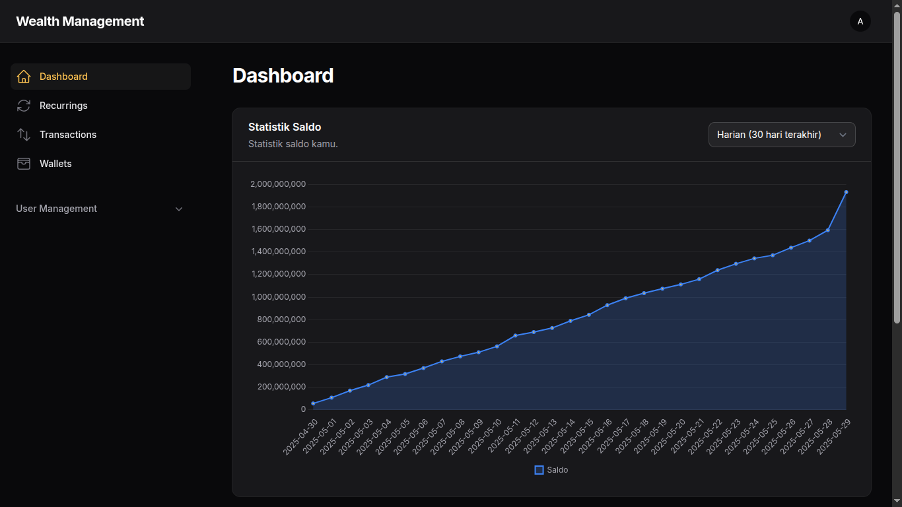

# 📊 User Wallet Dashboard



Sistem manajemen transaksi dan saldo pengguna berbasis Laravel + Filament. Menyediakan fitur pemantauan saldo secara harian, bulanan, YTD (Year-to-Date), dan keseluruhan, dengan dukungan wallet dan transaksi income/expense.

> *"Jika kamu tidak menemukan cara untuk menghasilkan uang saat tidur, kamu akan bekerja sampai mati."*  
> — Warren Buffett

---

## 🚀 Fitur Utama

- 📈 Statistik saldo real-time (harian, bulanan, YTD, semua)
- 🧾 Pencatatan transaksi (income dan expense)
- 👛 Multi-wallet per pengguna
- 🔐 Autentikasi pengguna dengan Laravel
- 🧪 Seeder dummy untuk pengujian data transaksi

---

## 🛠️ Instalasi

```bash
git clone https://github.com/yourusername/yourproject.git
cd yourproject

cp .env.example .env
composer install
php artisan key:generate
php artisan migrate --seed
php artisan serve
```

---